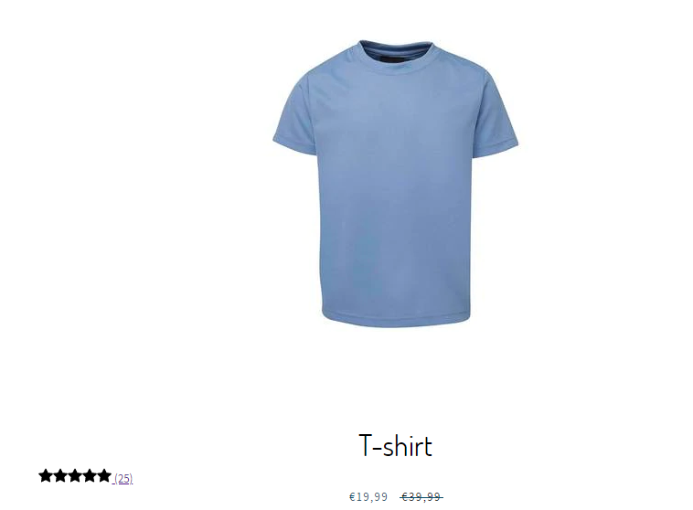
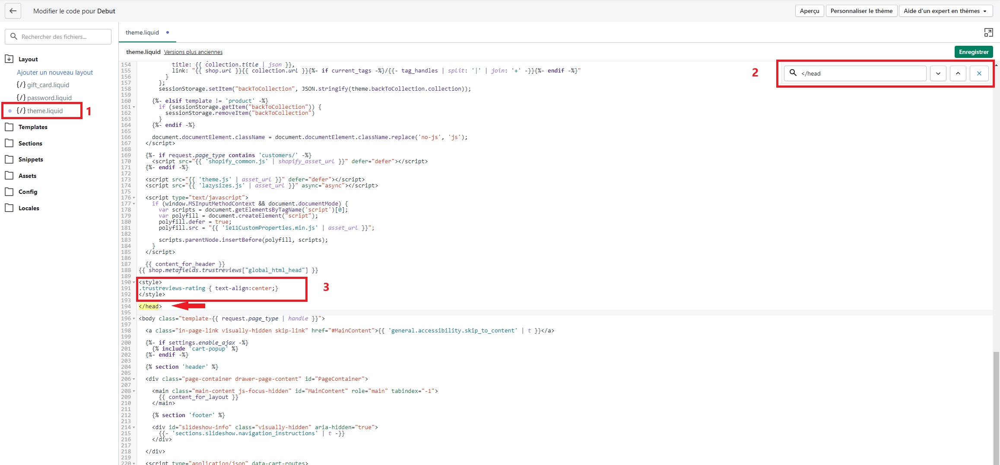

# Centrer les étoiles



1. Rendez-vous dans boutique en ligne -> Actions -> Modifier le code.
2. Cliquez sur **theme.liquid** et recherchez le **\</head>**.
3. Copiez le code ci-dessous et collez-le au dessus du **\</head>**. (Voir capture d'écran ci-dessous)
4. Pour rechercher le **\</head>**, effectuez un **ctrl + F** (Windows) ou **cmd + f** (Mac).

```
<style>
.trustreviews-rating { text-align:center;}
</style>
```



5\. Sauvegardez. En suite, rendez-vous sur votre site web et rafraîchissez la page. Rafraîchissez la page plusieurs fois si nécessaire, cela peut prendre quelques dizaines de secondes pour voir le changement. Vos étoiles seront désormais centrées avec le titre de votre produit.


