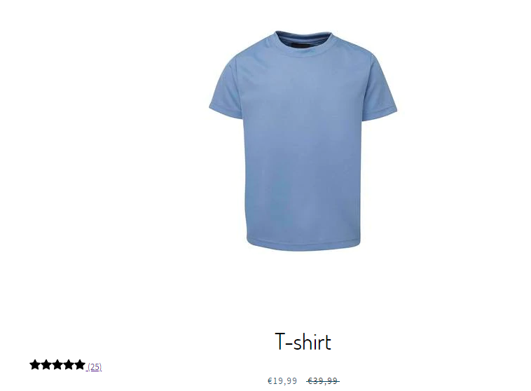
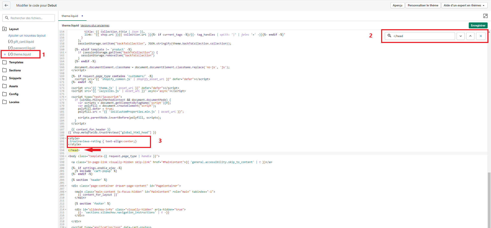
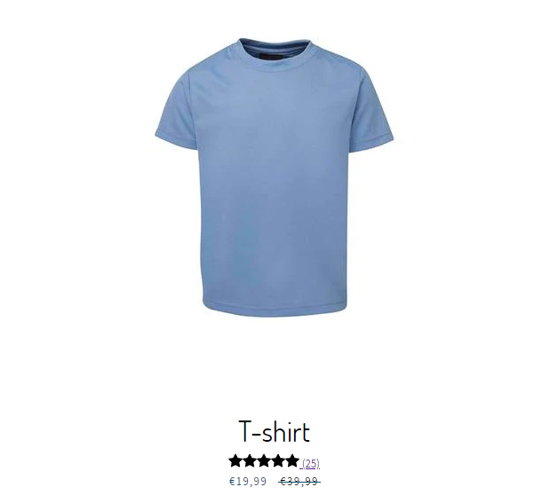

# center the stars



1. Go to Online Store -> Actions -> Edit Code.
2. Click on theme.liquid and search for the \</head>.
3. Copy the code below and paste it above the **\</head>** . (See screenshot below)
4. To find the **\</head>**, perform ctrl + F (Windows) or cmd + f (Mac).

```
<style>
.trustreviews-rating { text-align:center;}
</style>
```



5\. Save. Next, go to your website and refresh the page. Refresh the page several times if necessary, it may take a few tens of seconds to see the change. Your stars will now be centered with your product title.


